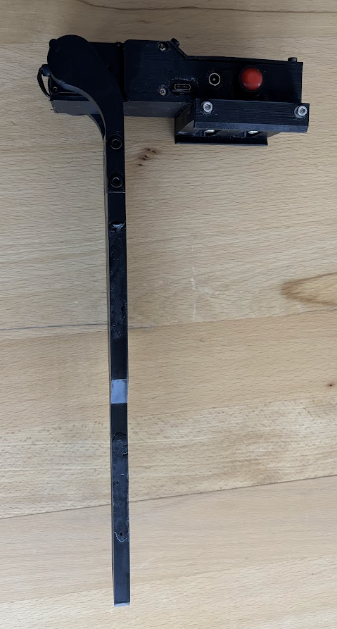
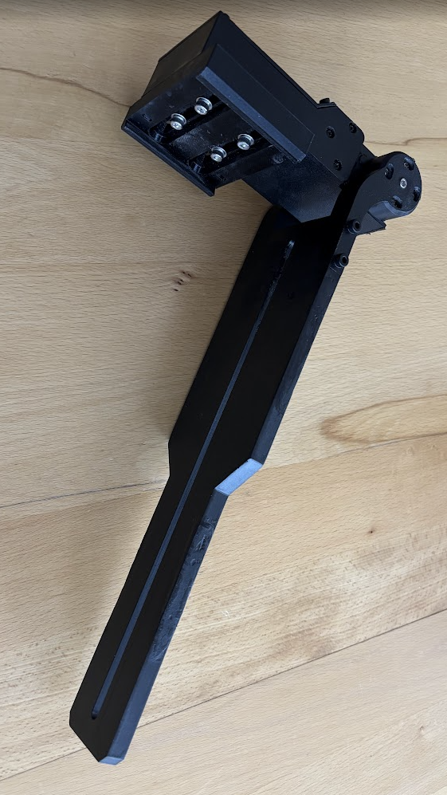
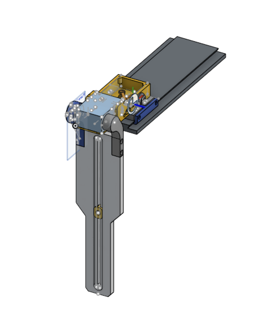
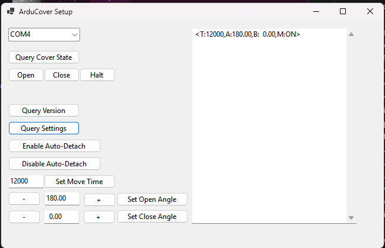

# ArduCover

ArduCover is an open-source solution for automating telescope covers and calibration panels. It combines custom Arduino firmware, an ASCOM driver, and a Windows setup/configuration utility.

## Features

- Smooth sine ramp for starting and stopping
- Configurable servo speed
- Manual button control (open, close, halt)
- Automatic servo detachment to minimize vibration
- Stores all values in internal EEPROM
- Configurable start and stop angles

## Hardware & 3D Model

# Demo Video

Click the image above to watch a demonstration of ArduCover in action.

- Designed for 150kg 270° Robotic Servo
- 3D printed Losmandy clamp with lateral adjustment
- Case for Arduino and electronics
- Arms and cover holder

[Onshape CAD Model](https://cad.onshape.com/documents/cd3083043bd7122621468bd5/w/43959cbc2e7920b21c95458f/e/187fb1b94c492288fe056a34?renderMode=0&uiState=68e272be639692699ff7fd0e)

## Firmware for Arduino Nano

Controls the motorized cover and calibration panel hardware. Derived from [DarkLight Calibrator](https://github.com/10thTeeAstronomy/DarkLight_CoverCalibrator) with improved servo control.

- Stepwise servo movement with microsecond-level PWM smoothing
- All movement logic uses float precision for angles and timing
- Multiple easing functions supported (linear, cubic, sine, etc.)
- Movement speed (`timeToMoveCover`) is user-settable via serial and saved/restored from EEPROM
- Servo open/close angles are user-settable via serial (with decimal point) and saved/restored from EEPROM
- Robust, non-blocking button and serial command handling
- EEPROM wear-leveling retained for all persistent settings
- Bug fix: reversing after halt now ramps smoothly and respects proportional timing
- Improved: button logic always sets direction before move, ensuring correct ramp and speed
- Improved: manual and serial control always use correct easing and proportional timing

## ASCOM Driver

Provides Windows-based integration for astronomy automation platforms. Allows remote and automated control of the cover and calibration panel via standard ASCOM interfaces.

## Windows Setup Program

Configuration utility for Arduino and driver installation. Includes graphical interface for setup and diagnostics.

## License

This project is licensed under the MIT License.

## Screenshots
- **ASCOM Driver**: Provides Windows-based integration for astronomy automation platforms.
- 
- **Windows Setup Program**: Simple configuration utility for Arduino and driver installation.
- 
